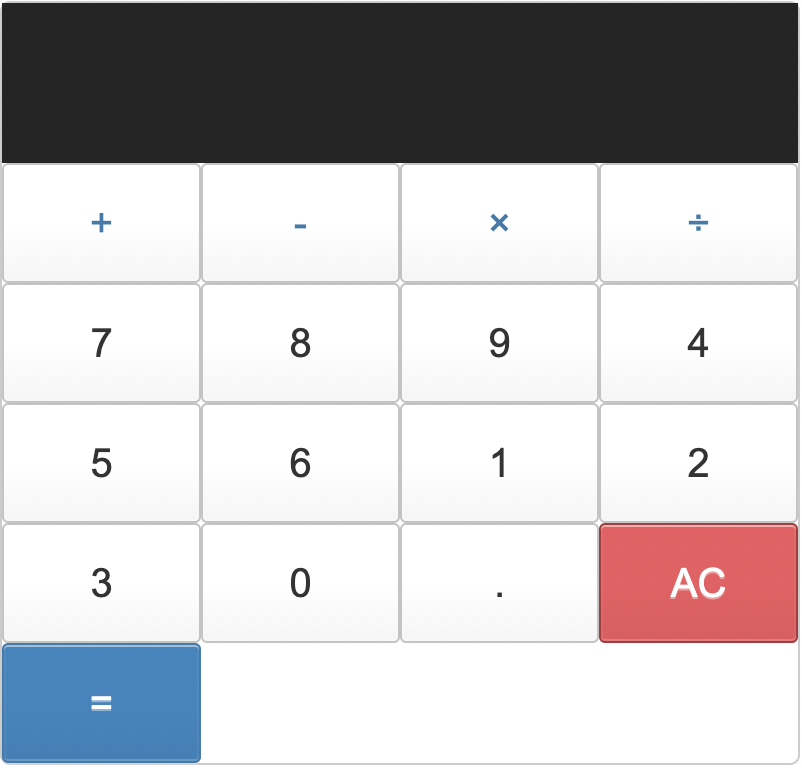

TypeScript based calculator application.

- This is a simple calculator app using HTML,CSS and TypeScript. 
There is a common function for every button on the calculator and that function run all the logic 
like 
1. Storing all the input the user is feeding
2. on "=" showing the evaluated result
3. on "AC" click deletes the input field

Note: HTML and CSS content is referred from internet 

